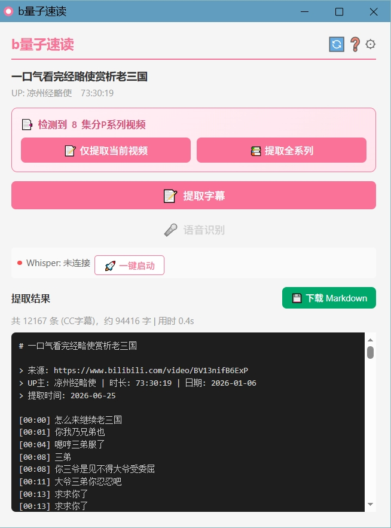

# bQuantumReader (b量子速读)

[](LICENSE)


从 B站视频提取 CC 字幕和评论，支持本地 Whisper 语音识别，生成结构化 Markdown 知识库。兼容 Chrome 与 Edge 浏览器。🎯

> A browser extension (Chrome / Edge) to extract Bilibili subtitles and comments with local Whisper ASR support. Generates structured Markdown.

---

## 🎯 最佳场景：与 AI 对话视频

遇到**长视频**（访谈类、观点类、剧情解析类），不想花一小时看完？这个工具就是为此设计的：

```
1. 📋 复制 B站 视频链接 → 粘贴到本工具
2. ⚡ 一键提取字幕 + 网友评论
3. 🤖 将生成的 Markdown 文件喂给 AI（GPT、DeepSeek、Claude 等）
4. 💬 让 AI 总结视频核心观点，同时结合弹幕/评论分析观众态度
```

你可以像这样与 AI 对话：

> **💡 问**：这个视频的核心观点是什么？UP主论证是否充分？
> **✅ 答**：UP主主要认为…，他用了三个论据… 评论区热度最高的观点是…，有 X% 的评论表示赞同/反对…

**🎉 效果**：无需看完长视频，就能以对话形式获取视频信息、UP主观点和社区反响，实现"与视频对话"的体验。

### 🎮 进阶场景：边玩边问的游戏攻略 / 旅游攻略

获取**游戏攻略视频、旅游攻略视频**的字幕喂给 AI，在游玩或旅行中遇到具体问题时直接问 AI，不用翻视频找答案：

> **🎮 问**：这个boss的二阶段怎么打？
> **✅ 答**：根据攻略，boss二阶段有三个技能… 应对方法是先…
>
> **✈️ 问**：去这个景点推荐住哪里？
> **✅ 答**：攻略推荐住在… 价格区间… 评论区推荐的是…

**🎉 效果**：攻略视频变成随身 AI 知识库，遇到什么问什么，不用全部看完。

---

## 📦 浏览器扩展

兼容 Chrome 和 Edge 浏览器。

### 功能特性

- **字幕提取** 🎬 — 自动获取 B站 CC 字幕，带时间戳生成 Markdown
- **评论提取** 💬 — 同步获取热门评论，集成到输出文档
- **语音识别** 🎙️ — 支持本地 Whisper 服务（faster-whisper），无需上传，保护隐私
- **一键启动** 🚀 — 原生消息主机 + 安装向导，零配置启动 Whisper
- **后台转录** ⏳ — 关闭弹窗后继续处理，随时回来查看结果
- **独立窗口** 🪟 — 可脱离 Chrome 工具栏独立操作
- **系列视频** 📚 — 自动检测多P分集，支持全系列字幕提取和 ZIP 打包下载



### 下载

从 [Releases](https://github.com/iambest1-hue/bQuantumReader/releases) 下载最新版 `bQuantumReader-v*.zip`。

### 安装步骤

**Chrome：**
1. 📦 解压下载的 zip 包
2. 🔧 地址栏输入 `chrome://extensions/` 回车
3. 🛠️ 打开右上角 **开发者模式**
4. 📂 点击 **加载已解压的扩展程序**，选择解压后的文件夹

**Edge：**
1. 📦 解压下载的 zip 包
2. 🔧 地址栏输入 `edge://extensions/` 回车
3. 🛠️ 打开左下角 **开发人员模式**
4. 📂 点击 **加载解压缩的扩展**，选择解压后的文件夹

安装后打开任意 B站 视频页面，点击扩展图标即可使用。🎉

> 📖 语音识别服务的详细安装指南见 [INSTALL.md](INSTALL.md)。
> 🔔 提取/转写完成后会弹出系统通知并伴有提示音，鼠标移动到扩展窗口上或点击通知可停止铃声。

### 语音识别

支持本地 Whisper 服务，数据无需上传，完全本地处理。

| 模型 🧠 | 大小 💾 | 速度 ⚡ | 适用场景 🎯 |
|------|------|------|---------|
| tiny | ~80MB | ⚡⚡⚡⚡⚡ | 测试/低配电脑 |
| base | ~150MB | ⚡⚡⚡⚡ | 日常使用 |
| small | ~500MB | ⚡⚡⚡ | 默认推荐 |
| medium | ~1.5GB | ⚡⚡ | 高质量需求 |
| large-v3 | ~3GB | ⚡ | 最高精度 |

### ⚙️ 技术栈

- **浏览器扩展** 🧩 — Manifest V3, 纯 JavaScript (兼容 Chrome / Edge)
- **Whisper 服务** 🐍 — Python Flask, faster-whisper (CTranslate2)
- **通信** 🔗 — Native Messaging API, HTTP REST

### 项目结构

```
bQuantumReader/
├── manifest.json              # 扩展配置 (Manifest V3)
├── background/                # Service Worker (消息路由、API 调用)
├── content/                   # 页面注入脚本 (B站视频信息提取)
├── popup/                     # 主界面 + 安装向导
│   ├── popup.html/js/css
│   └── install_wizard.html/js
├── options/                   # 设置页面
├── offscreen/                 # 后台转录文档
├── shared/                    # 公共模块
│   ├── bilibili-api.js        # B站 API 封装 (WBI 签名)
│   ├── asr.js                 # Whisper ASR 通信协议
│   └── markdown.js            # Markdown 生成器
├── help/                      # 帮助页面
├── icons/                     # 扩展图标
└── whisper_server/            # 语音识别服务 (Python/Flask)
    ├── server.py              # Flask HTTP 服务
    ├── native_host.py         # Native Messaging 主机进程
    ├── install.ps1 / .bat     # 一键安装脚本
    └── start_server.ps1 / .bat# 启动脚本
```

---

## 📱 Android App

将 bQuantumReader 的核心能力移植到 Android 平台，原生体验，无需电脑。已独立为 [bQuantumReader-Android](https://github.com/iambest1-hue/bQuantumReader-Android) 仓库。

### ✨ 功能

- **链接解析** 🔗 — 粘贴 B站 视频链接，自动提取 bvid
- **视频信息展示** 🖼️ — 封面、标题、UP主、时长
- **字幕提取** 🎬 — 调用 B站 CC 字幕 API（WBI 签名），提取带时间轴的字幕内容
- **Markdown 生成** 📝 — 自动整理为结构化 Markdown
- **结果操作** 📤 — 预览、复制、分享、保存为 .md 文件
- **评论提取** 💬 — 同步获取视频热门评论
- **B站 登录** 🔑 — 扫码登录

### 📥 下载

[**📥 下载 APK**](https://github.com/iambest1-hue/bQuantumReader-Android/releases)
要求：Android 10.0+（API 29+）

### ⚙️ 技术栈

Kotlin + Jetpack Compose + Material3 🧩 / Retrofit + OkHttp 🌐 / MVVM + Repository 🏗️

### 📖 更多信息

前往 [bQuantumReader-Android](https://github.com/iambest1-hue/bQuantumReader-Android) 查看完整说明、安装步骤、构建指南和项目结构。

---

## ☕ 自愿捐助

如果这个项目对你有帮助，欢迎请作者喝杯咖啡 😊

| 微信 | 支付宝 |
|------|--------|
|  |  |

## 📄 关于

- **项目地址** 🌐：https://github.com/iambest1-hue/bQuantumReader-Android
- **作者** 👤：[iambest1-hue](https://github.com/iambest1-hue)

---

## 📄 许可证

[MIT License](LICENSE) ✅
